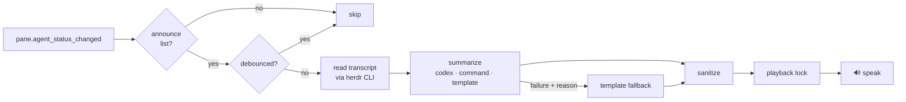

<div align="center">

# herdr-announcer

**Your agents, out loud.** A [Herdr](https://herdr.dev) plugin that speaks a
one-sentence summary when a coding agent finishes its work or gets stuck
waiting for you.

[](https://github.com/nhclink16/herdr-announcer/actions/workflows/test.yml)
[](https://github.com/nhclink16/herdr-announcer/releases)
[](LICENSE)


[Install](#install) · [Quick start](#quick-start) ·
[Configuration](docs/configuration.md) ·
[Voices & multi-host](docs/multi-host.md) ·
[Troubleshooting](docs/troubleshooting.md) ·
[Development](docs/development.md)

</div>


🔊 [What it sounds like](assets/sample-announcement.m4a) — *"Builder finished
mid-cycle proration in billing-api, all fourteen invoice tests passed,
downgrade logic left untouched."*

## Install

```bash
herdr plugin install nhclink16/herdr-announcer
```

## Quick start

The event hook is live immediately with defaults: announce `done` +
`blocked`, Codex summaries if `codex` is on your PATH, local
text-to-speech.

> [!TIP]
> No codex? Nothing breaks — you get instant template phrasing instead of
> an LLM sentence.

Tailor it with the wizard, then test the voice:

```bash
herdr plugin pane open --plugin nhclink16.announcer --entrypoint setup
herdr plugin action invoke nhclink16.announcer.test
```

(Or from the plugin directory in any terminal: `python3 announce.py setup`.
Ctrl-C exits without writing; the wizard previews the config and asks before
saving.)

<details>
<summary>Bind the wizard and status to keys</summary>

In `~/.config/herdr/config.toml`:

```toml
[[keys.command]]
key = "prefix+a"
type = "shell"
command = "herdr plugin pane open --plugin nhclink16.announcer --entrypoint setup"
description = "announcer setup"

[[keys.command]]
key = "prefix+shift+a"
type = "plugin_action"
command = "nhclink16.announcer.status"
description = "announcer status"
```

</details>

## Features

- **Real summaries, not "task complete"** — one spoken sentence generated
  from the tail of the agent's terminal output, by sandboxed `codex exec`,
  any CLI LLM, or instant template phrasing with no LLM at all
- **Three voices** — OS text-to-speech (free, built-in), ElevenLabs, or any
  custom command: SSH to the machine you're sitting at, an
  [ntfy](https://ntfy.sh) push, [piper](https://github.com/rhasspy/piper),
  anything that takes text
- **Never goes silent, never talks over itself** — LLM failures fall back to
  template phrasing under a fast activity deadline; simultaneous finishes
  queue behind a playback lock
- **Failures explain themselves** — every fallback records *why*
  (`reasons=codex: timeout-first-activity`) in the log, and `status` shows
  the last error, so "why is it the robot voice?" is a glance, not an
  investigation
- **Optional toast** — mirror every announcement as a Herdr notification
  (reaches you over SSH when sound can't)

## How it works



Untrusted transcripts never reach an agentic tool with write access — codex
summaries run `--sandbox read-only --ephemeral` — and summaries are
sanitized to plain words before any `speak_command` sees them.

## Requirements & limitations

- Herdr ≥ 0.7.0, macOS or Linux, Python 3.9+. Linux local TTS wants
  `espeak-ng`, `espeak`, or `spd-say` ([one caveat](docs/configuration.md#voices));
  macOS needs nothing.
- **Watched work doesn't announce.** Herdr marks an agent `done` only when
  it finishes *unseen*; a pane you're actively viewing settles as `idle`.
  That's by design — the announcer covers work behind your back.
- No per-agent filtering yet — every detected agent announces.

> [!WARNING]
> Audio plays on the machine running the Herdr server. Attached over SSH?
> [Two escape hatches](docs/multi-host.md), including a router that follows
> you between devices.

## License

MIT — see [LICENSE](LICENSE).
